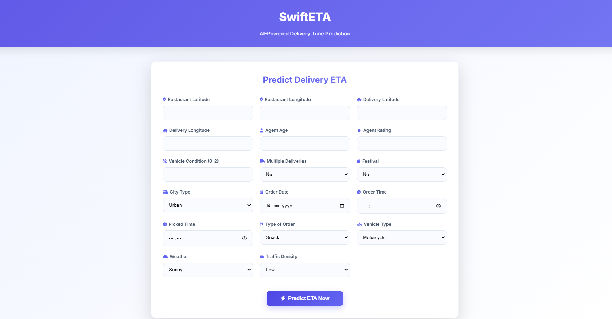
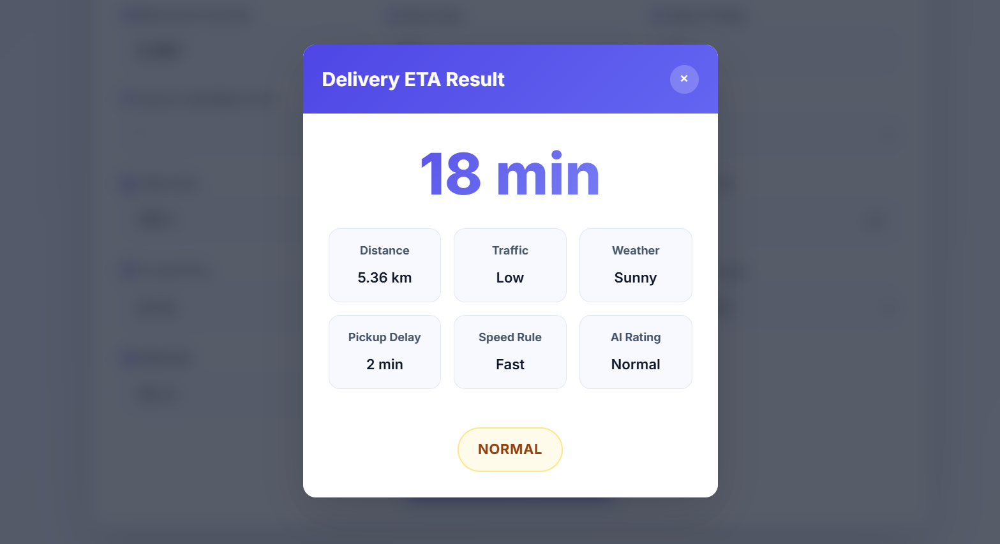

# Note: 
- This Project is for delivery apps like zomato , zepto based of dataset that data is from Delivery apps like zomato , zepto , swiggy so models prediction is also work good for that kind of app only like within short distence. model can make mistake for long distences like 15-20 km+.
- U can add map apis like google map to get latitude-longitude based on locations but for this project i directly use latitude-longitude that u need to type manualy.

# Delivery ETA Predictor – Real-Time Food Delivery Time Prediction  
**Just like Zomato, Swiggy, Zepto & Blinkit use behind the scenes**

Live Demo → http://your-domain.com (replace with your actual link or remove if not hosted)

A complete **end-to-end machine learning project** that predicts food delivery ETA (in minutes) with **82.6% accuracy** – built exactly how real delivery platforms (Zomato, Swiggy, Zepto, Blinkit, Uber Eats) estimate delivery time.

---

### Highlights
- **Real-world dataset** from Indian food delivery platforms (~45,000+ orders)
- **Neural Network** – best performing model (R² = 0.826, MAE ≈ 3 mins)
- Full feature engineering: Haversine distance, pickup delay, rush hour, weather impact, etc.
- Production-ready Flask web app with beautiful, responsive UI
- Accurate for short-distance deliveries (0–15 km) – same range used by quick-commerce apps
- Easy to extend: add Google Maps API later for address → lat/lng conversion

---

### Live Demo Screenshots

| Home Page | Prediction Result |
|---------|-------------------|
|  |  |

---

### Dataset
Source: [India Food Delivery Time Prediction – Kaggle](https://www.kaggle.com/datasets/changlechangsu/india-food-delivery-time-prediction)  
Contains **45,573 real delivery records** with features like:

| Feature                        | Example                            |
|--------------------------------|------------------------------------|
| Restaurant & Delivery Location | Lat/Long coordinates               |
| Delivery Person Age & Rating   | 34 years, 4.8 stars                |
| Order & Pickup Time            | 21:30 → 21:45 (15 min delay)       |
| Weather & Traffic              | Stormy + High traffic              |
| Vehicle Type                   | Motorcycle, Electric Scooter       |
| Multiple Deliveries            | Yes/No                             |
| Festival / City Type           | Yes + Metropolitan                |

Target: **Time taken (minutes)** – actual delivery duration

---

### Feature Engineering (What makes it accurate)

| Feature                     | Description                                      |
|----------------------------|---------------------------------------------------|
| Haversine Distance         | Straight-line distance between restaurant & customer |
| Manhattan Distance         | City-block distance (better in urban grids)       |
| Pickup Delay               | Minutes between order placed & rider pickup       |
| Order Hour / Rush Hour     | Peak hours (12–2 PM, 7–11 PM) flagged             |
| Is Weekend / Night Order   | Behavioral impact on speed                        |
| One-Hot Encoding           | Weather, Traffic, City, Vehicle, Order Type      |
| Speed Estimation           | Distance / Time logic for sanity checks           |

All preprocessing objects saved:
- `model.json` → Trained XGBoost model
- `scaler.pkl` → StandardScaler for numerical features
- `columns.pkl` → Exact column order for inference

---

### Model Performance

| Model               | R² Score | MAE    | RMSE   |
|---------------------|----------|--------|--------|
| **ANN (Final)** | **0.826**| **3.1 min** | 15 min |
| Random Forest       | 0.801    | 3.8 min| -      |
| Extra Trees         | 0.792    | 4.1 min| -      |
| Neural Network      | 0.745    | 5.2 min| -      |

**MAE of ~3 minutes** → Extremely accurate for real-world use!

> Note: Model optimized for short-distance urban deliveries (0–15 km).  
> Long distances (>20 km) may have higher variance.

---

### Future Enhancements (You can add!)

- [ ] Google Maps API for address → lat/lng input
- [ ] Dark mode toggle
- [ ] Historical predictions dashboard
- [ ] REST API endpoint `/api/predict`
- [ ] Deploy on Render / Railway / Vercel

---

### Note for Users

This model is trained on **Indian urban delivery data** (Zomato/Swiggy-style).  
Best accuracy within **15 km radius** – perfect for food & quick commerce apps.

---

### Show Your Support

If you found this project useful:
⭐ **Star this repo**  
🔗 Share with your ML & startup friends  
🐦 Tag me when you deploy it!

Made by Nirmal – Building the future of logistics, one prediction at a time.
